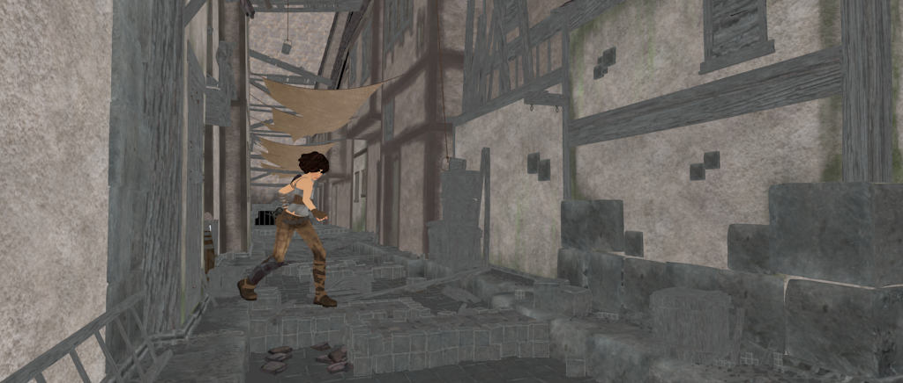
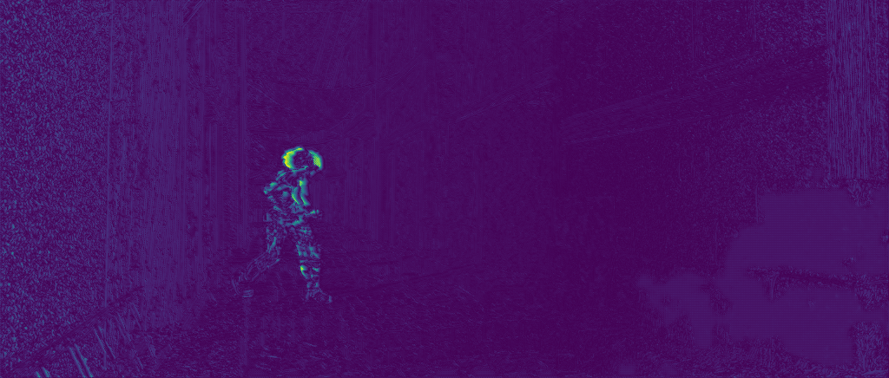

# Unsupervised Optical Flow Estimation

Optical flow is the pattern of apparent motion of image objects between two consecutive frames caused by the movement of object or camera. It is the 2D vector field where each vector is a displacement vector showing the movement of points from first frame to second.
Optical flow works on several assumptions:
1. The pixel intensities of an object do not change between consecutive frames.
2. Neighboring pixels have similar motion.
 
Estimating dense optical flow is one of the longstanding problems in computer vision, with a variety of applications.
Most of the CNN based approaches rely on the availability of a large amount of ground truth for supervised learning.
Due to the difficulty of obtaining ground truth in real scenes, such networks are trained on synthetically generated images, for which dense ground truth is easy to obtain in large amounts. 
However, because of the intrinsic difference between synthetic and real imagery and the limited variability of synthetic datasets, the generalization to real scene remains challenging.
In order to cope with the lack of labeled real-world training data, we propose a network based on unsupervised learning.
 
We introduce an end-to-end unsupervised approach that demonstrates the effectiveness of unsupervised learning for optical flow.
We propose a new unsupervised loss function. 
We compute bidirectional optical flow both in the forward and backward direction, performing a second pass with the two input images exchanged.
We train our network on MPI Sintel dataset. 
Thus, we move forward in the direction of eliminating the need for ground truth for optical flow estimation.
 

### Result
The two image frames, output of the network and the ground truth are displayed below:
 

frame_1

 

frame_2

 

Output

 

ground truth

 

